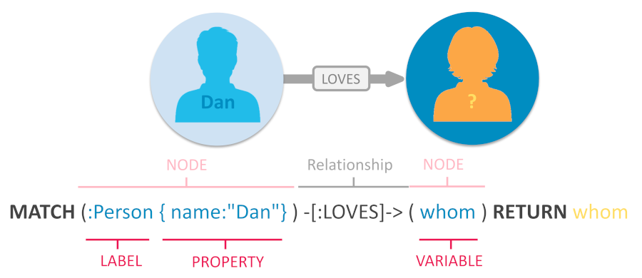

# Infi Dojo Neo4j for beginners

## What is Neo4j?

Neo4j is a native graph database. It's a No-SQL database which focuses on storing and querying complex relations. It stores the relationships between _nodes_ (objects) on each of these objects. This way Neo4j doesn't have to lookup relationships at query time. This makes it faster to query relations compared to e.g. a SQL-database, which needs to do (indexed) lookups over and over at query time.

The benefits compared to other databases are more noticeable when the data and query complexity increase.

It can save millions if you want to [travel to Mars 🚀](https://neo4j.com/users/nasa/)

You can find more detailed information at the Neo4j website: [https://neo4j.com/developer/graph-database](https://neo4j.com/developer/graph-database).

### What will you learn in this dojo?

- You'll learn about basic concepts, such as _nodes_, _Labels_ and _relationships_.
- We'll do some simple queries to get you started with _Cypher_, the query language Neo4j uses.
- Afterwards we'll show you some more useful problems to solve
- If you have time left you can dive into the world of algorithms

### What do we expect from you?

Not much!
- But at least a basic understanding about databases.
- Make sure you've a Neo4j account so you can use the free [sandbox environment](https://sandbox.neo4j.com/)
- We'd also love to hear your opinion on the subject during this evening.

## Basic concepts and queries

Graph databases have no concepts of tables, records or foreign keys. Instead labels, nodes and relationships are uses which resemble these concepts somewhat. Let's take a look at them:

**Nodes**

Nodes are the entities in the graph.

- Nodes can be tagged with _labels_, representing their different roles in your domain. (For example, Person).
- Nodes can hold any number of key-value pairs, or properties. (For example, name)
- Node _labels_ may also attach metadata (such as index or constraint information) to certain nodes.

**Relationships**

- Relationships provide directed, named, connections between two node entities (e.g. Person LOVES Person).
- Relationships always have a direction, a type, a start node, and an end node, and they can have properties, just like nodes.
- Nodes can have any number or type of relationships without sacrificing performance.
- Although relationships are always directed, they can be navigated efficiently in any direction.

## The query language: Cypher

The Cypher query language is quite intuitive, as it visually resembles the components of your query.

Nodes are defined by parenthesis `()` and relationships by arrows `-->`

These can get a little more complex later on, but you'll always recognize these two based on their form in the query.

**A simple query**

A very simple query could look like this:

```
MATCH (n1)-->(n2)
RETURN n1, n2
```

This will return all nodes that have a relationship which each other. Fun, but not very useful.

**Query by property**

In the real world you'd probably want to specify things a little bit more.

```
MATCH (n1{id: 7})-->(n2)
Return n2
```

This will return all related nodes for the node with id 7. You can limit your query based on every property or properties a node has. e.g.:

```
MATCH (n1{age: 7, city: Amsterdam})-->(n2)
Return n2
```

**Query by label**

Besides properties, nodes can have labels. These are a bit similar to table names in a sql database. We can use them categorize the different entities in our database. For instance:

```
MATCH (p:Person)-->(b:Book)
RETURN p,b
```

This will return all relationships between persons and books.

**Query by relationship**

We know how to query relationships between certain object now. But we've no clue what the nature of this relationship is. Fortunately we can also specify the type of relationship in our query.

```
MATCH (p:Person)-[:LOVES]->(m:Movie)
RETURN p,m
```

OR

```
MATCH (p:Person)-[:HATES]->(m:Movie)
RETURN p,m
```

**Summary**

All this new syntax might be a bit overwhelming. But it's just syntax, so don't worry! Here's a neat little picture which summerizes the basic elements of cypher query. _Make sure you understand all aspects before you continue_ and feel free to ask us for extra explanation.


## Try it yourself

Let's get our hands dirty now! Open a new movie db sandbox on [sandbox environment](https://sandbox.neo4j.com/).

This is a simple graph database filled with some example data to get us started.

### 1. How many are there?

Let's explore this database a bit.

**How many movies?**
Let's find out how many movies there are. We'll use the count function:

```
MATCH (movies:Movie)
RETURN count(movies)
```

**How many actors?**

That was easy!
Now we'd like to find out how many actors there are. So we need to expand our MATCH statement:

```
MATCH (actors:Person)-[:ACTED_IN]->(:Movie)
```

Nice! Now we know there are 102 actors!
Or... wait. Did you get 172?

The sandbox graph ui hides the fact that you query every `ACTED_IN` relation for every actor and movie combination. To prove this run the following query and open the text view of the query result (on the left side).

```
MATCH (actors:Person)-[:ACTED_IN]->(movies:Movie)
RETURN actors, movies
```

Every relation is queried, and thus counted! Just like a `JOIN` in SQL.

The fix is easy, use the DISTINCT keyword: `RETURN count(DISTINCT actors)`. Now it should return 102.

**Keep on going!**

Can you find out how many directors, writers and reviewers there are?

Tip: you can query all relationship types like this:

```
MATCH ()-[r]->()
RETURN DISTINCT type( r)
```

### 2. Who acted in The Matrix?

Can you query all the actors that played in The Matrix?

Tip: use the title property on the Movie nodes. When you query all movies and hover over them you'll see the properties at the bottom of the query result.

If you succeeded you might want to find out which other people were involved with The Matrix.

Tip: instead of returning specific variables, you can also use a wildcard: `RETURN *`

### 3. Who's Eddie?

This one is a bit tricky!

Please find out which actor played Eddie and in which movie.

Note that relationships can have properties as well, just as nodes. In this case we need to lookup the roles property (Which is an array by the way! Who = `['Eddie']`?)

### 4. Act like you know how(ard)

Can you find out which actors played in movies directed by Ron Howard?

Tip: `()-[]->()<-[]-()`

### 5. CrUD

We've matched (read) some things now. But we'd like to give you a quick introduction in how you can create, update and delete entities in Neo4j.

**Create all the things**
Add the movie "Django Unchained" to the database. Instead of the `MATCH` keyword, you need to use the `CREATE` keyword. Don't return anything.

You can also create relationships with the same syntax as you've used with `MATCH`.
Let's add "Quentin Tarantino" as the director. Mind the direction of the relationship. In this database the relations go from persons to movies. Try it!

You can create multiple nodes and relationships with the `CREATE` keyword. But you'll get an error if you try to create existing nodes. In this case we need to `MATCH` our movie first and create the director and relationship on that matched movie. Try it!

This can be cumbersome at times, in which case the `MERGE` statement is a good replacement for `CREATE`. It functions as a upsert method, meaning it'll create non existing entities an matches existing entities. Please add the actor Jamie Fox to this movie using the `MERGE` statement only.

**Update entities**
Maybe you already have a node or relationship in the data, but you want to modify its properties. You can do this by matching the pattern you want to find and using the `SET` keyword to add, remove, or update properties.
Add the movies' tagline "Life, liberty and the pursuit of vengeance." to its node, using the `SET` keyword.

We can also use `MERGE` to link an existing actor to our new movie. Create an `ACTED_IN` relationship between "Keanu Reeves" and "Django Unchained".

note that when  you use `CREATE` you can add multiple identical relationships to the same node.

**Delete entities**
Foolish! Let's delete that relationship!
Match the _relationship_  and delete it using the `DELETE` statement.

Now delete our new Movie.

You might have seen that you can't delete nodes that still have relationships. You could delete every relationship. But it's quicker to use `DETACH DELETE`. Please try it!

## Recommendations

We're going to add some more data to the database before we move on with some exercises concerning recommendations.

Start by adding more reviewers that give some of the movies a random rating:

```
MATCH (m:Movie)
UNWIND ["Russel Ellis","Ken Chambers","Della Peterson","Norma Harper","Tyrone Butler","Sam Stewart","Christina Waters","Edwin Warren","Meredith Moran","Jo Porter","Santiago Erickson","Darryl Gonzalez","Tabitha Goodman","Wilbert Clayton","Troy Allen","Bill Barker","Sherman Pena","Nicolas Reynolds","Brittany Grant","Juan Welch"] as name
MERGE (p1:Person {name:name})
FOREACH(ignoreMe IN CASE WHEN (rand() > 0.6) THEN [1] ELSE [] END |
    MERGE (p1)-[:REVIEWED {rating: toInteger(rand()*100)}]->(m)
)
RETURN p1,m
```

Then let some reviewers follow other reviewers:

```
MATCH (p1:Person)-[:REVIEWED]->(:Movie), (p2:Person)-[:REVIEWED]->(:Movie)
WHERE p1 <> p2
WITH DISTINCT p1,p2
FOREACH(ignoreMe IN CASE WHEN (rand() > 0.75) THEN [1] ELSE [] END |
    MERGE (p1)-[:FOLLOWS]->(p2)
)
RETURN *
```

And finally add a born property to every reviewer:

```
MATCH (p:Person)-[:REVIEWED]->(:Movie)
SET p.born = toInteger(rand() * 50) + 1950
RETURN p          
```

### 7. Reviewer recommendations: second-degree contacts

Now we're going to recommend some reviewers for Norma Harper to start following.
Write a query that returns 10 reviewers that are being followed by reviewers that Norma Harper is following. These are reviewers she might know or might want to get to know.

### 8. Reviewer recommendations: similar age

Now let's find the first 10 reviewers with an age closest to Norma Harper which have reviewed the same movies as she.

### 9. Reviewer recommendations: similar movie ratings

Find out which reviewer gives the most similar movie ratings to "Norma Harper". Please return the first 10 results for this one too.

Note that Russel Ellis might have more rated movies in common with Norma Harper than Sam Stewart. It's perfectly fine to use `avg()` for this exercise. If you wanted to take the count of movies into account you could roll your own averaging function instead.

### 10. Movie recommendations: movies that reviewers around Norma's age like

From recommending reviewers to recommending movies. Please find the ten best rated movies for the reviewers that were born closest to Norma Harper's birth year.

### 11. Movie recommendations: best rated movie for the genre Norma likes best

First add Genre nodes with an `IN_GENRE` relationship to all movie nodes based on the mapping you can find in the [movie-genres.json](movie-genres.json).

Run

```
CALL apoc.load.json("https://raw.githubusercontent.com/infi-nl/dojo-neo4j-graph-database/main/movie-genres.json?token=GHSAT0AAAAAABPKD3ICS35FT2FSYE7AWPPUYS37MSQ")
YIELD movieWithGenre
MATCH (m:Movie {title: movieWithGenre.title})
UNWIND movieWithGenre.genre as genre
MERGE (g:Genre {name: genre})
MERGE (m)-[:IN_GENRE]->(g)
RETURN m,g
```

Now write a query that returns the 10 best rated movies for the genre Norma Harper likes best. Like in exercise 8 you can use `avg()` or write an average function yourself.

### 12. Recommendations: Pearson algorithm

Let's work with another dataset that enables us to use the Graph Data Science library. Open a new [sandbox](https://sandbox.neo4j.com/) named "Recommendations". It's similar to the movie dataset we have been using.

Now try to find users (nodeLabel: `Users`) most similar to "Cynthia Freeman" based on their movie ratings (relationshipType: `RATED`). But this time use the [`gds.similarity.pearson` algorithm](https://neo4j.com/docs/graph-data-science/current/algorithms/similarity-functions/). This algorithm is particularly well-suited for product recommendations because it takes into account the fact that different users will have different mean ratings: on average some users will tend to give higher ratings than others. Since Pearson similarity considers differences about the mean, this metric will account for these discrepancies.

### 13. Recommendations: Similar movies based on multiple criteria

Now let's find the 10 most similar movies to "Matrix, The" based on budget, imdbRating, revenue and release year.

First you'll have to use the Graph Data Science library to normalize these properties. Otherwise one property could have more weight in the similarity algorithm. Run the following queries sequentially to normalize the properties.

```
CALL gds.graph.project("movieGraph", [{Movie: {properties: ["budget", "imdbRating", "revenue", "year"]}}], "*")
```

```
CALL gds.alpha.scaleProperties.mutate("movieGraph", {nodeProperties: ["budget", "imdbRating", "revenue", "year"], scaler: "MinMax", mutateProperty: "scaledProperties"})
YIELD nodePropertiesWritten
```

```
CALL gds.graph.writeNodeProperties("movieGraph", ["scaledProperties"])
```

Note that you can change the scaler and choose one depending on the distribution of your data.
If all went well you will have created a scaledProperties property on the Movie node. Go and see what it looks like.

Now you can actually write the query. Use the [gds.similarity.euclideanDistance algorithm](https://neo4j.com/docs/graph-data-science/current/algorithms/similarity-functions/) to find the 10 most similar movies to "Matrix, The" based on budget, imdbRating, revenue and release year.
